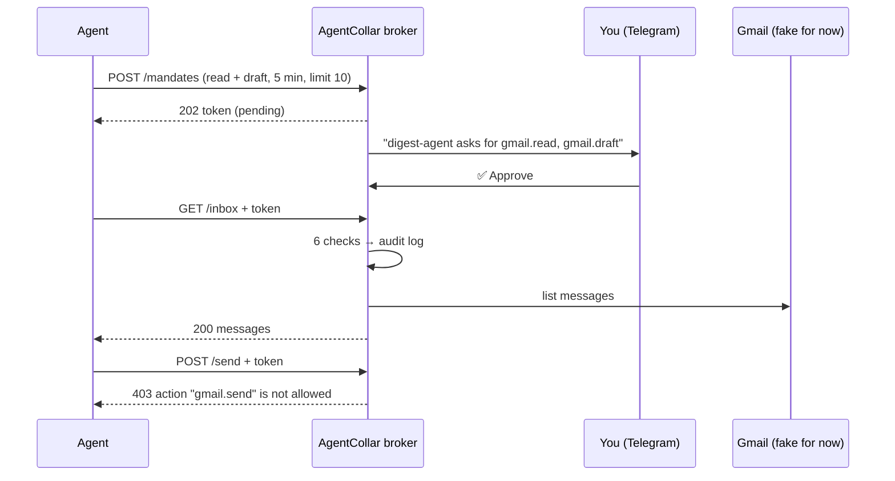

<p align="center">
  
</p>

<h1 align="center">AgentCollar</h1>

<p align="center">
  <strong>Let agents work. Keep the keys.</strong><br />
  A small broker between your AI agents and your accounts.<br />
  Agents get a short-lived pass for one task — never your password.
</p>

<p align="center">
  <a href="https://ank8dev.github.io/agentcollar/">Website</a> ·
  <a href="#quick-start">Quick start</a> ·
  <a href="#how-it-works">How it works</a> ·
  <a href="#roadmap">Roadmap</a>
</p>

> **Status: early, building in public.** The broker works end to end with a **fake Gmail inbox**.
> Real Gmail, persistence and MCP are next. Do not connect real accounts yet.

---

## Why

Today you connect an agent to Gmail once, and it can read, send and delete — until you remember to turn it off.
That is not giving work to an employee. That is giving a stranger your house keys.

AgentCollar puts a gate in between:

- **The agent never sees your password or tokens.** It only holds a random mandate token.
- **Access is per task, not per connection:** "read + draft, for 5 minutes, max 10 actions".
- **A human approves every mandate** — in Telegram or in the terminal.
- **Every request is checked**, and every decision is written to an audit log.
- **One tap revokes** a mandate instantly.

## How it works



### The 6 checks

Every request runs these checks **in order**. The first one that fails stops the request.

| # | Check | If it fails |
|---|---|---|
| 1 | The token is known (we issued it) | `401` unknown token |
| 2 | A human approved the mandate | `403` waiting for approval / denied |
| 3 | The mandate has not expired | `403` expired |
| 4 | The mandate was not revoked | `403` revoked |
| 5 | This action is in the mandate | `403` action not allowed |
| 6 | The action limit is not reached | `429` limit reached |

The clock starts **on approval**, not on request. Only allowed actions count towards the limit.

## Quick start

Requires **Node.js 22+**.

```bash
git clone https://github.com/ank8dev/agentcollar
cd agentcollar/broker
npm install
```

**1. The core, in one command** (no network, no Telegram):

```bash
npm run demo
```

You will see: a mandate is issued → read and draft are allowed → send is denied → the mandate expires → revoke.

**2. The broker as a server + a pretend agent** (two terminals):

```bash
# terminal 1
npm run server        # asks you to approve in this terminal: answer y

# terminal 2
npm run agent         # asks for a mandate, waits for you, reads, drafts, tries to send
```

**3. Approve in Telegram instead of the terminal:**

```bash
cp .env.example .env
```

- Create a bot with [@BotFather](https://t.me/BotFather) → put the token in `TELEGRAM_BOT_TOKEN`.
- Get your numeric id from [@userinfobot](https://t.me/userinfobot) → put it in `TELEGRAM_USER_ID`.
- Open your bot in Telegram and press **Start**, then run `npm run server` again.

Mandate requests now arrive in Telegram with **Approve / Deny** buttons, and **Revoke** after approval.
Only `TELEGRAM_USER_ID` can press them. `.env` is git-ignored.

## API

The broker listens on `127.0.0.1:8787` only. Agents send the mandate token as `Authorization: Bearer <token>`.

| Method | Path | Action checked | Notes |
|---|---|---|---|
| `POST` | `/mandates` | — | Ask for a mandate. Body: `agent`, `task`, `allowedActions` (e.g. `["gmail.read"]`), `expiresInSeconds` (≤ 86400), `limit` (≤ 1000). Returns `202` + token |
| `GET` | `/mandate` | — | The state of your own mandate (`pending`, `approved`, …) |
| `POST` | `/mandates/:id/revoke` | — | Kill switch. Revoking only removes access |
| `GET` | `/inbox` | `gmail.read` | Fake inbox |
| `POST` | `/drafts` | `gmail.draft` | Body: `to`, `subject`, `body` |
| `POST` | `/send` | `gmail.send` | Same body. Denied unless the mandate allows sending |

## Security notes

What the broker already does, and why:

- **Tokens are 256-bit random** and never written to the audit log.
- **The audit log is append-only**, one line per event. Text from agents is escaped, so an agent cannot forge extra log lines.
- **The approval message cannot be spoofed.** Actions must look exactly like `app.verb`. The facts the broker enforces are shown first; the agent's own words come last, on one sanitized line. A request for `*.send` shows a clear warning.
- **Only your Telegram account can approve.** Presses from anyone else are ignored.
- **No requests from browsers.** A web page can also reach `localhost`, so the broker checks the `Host` header (against DNS rebinding), refuses requests with an `Origin`, and accepts only `application/json`.
- **Small, bounded input:** bodies up to 10 KB, at most 20 actions, at most 1 day per mandate.
- **No runtime dependencies.** Only Node's built-ins: `http`, `crypto`, `fetch`.

Known limits today: mandates live in memory (they disappear on restart), Gmail is fake, and there is no encryption at rest yet because there are no real secrets to store.

## Roadmap

- [x] Mandates, the 6 checks, revoke, audit log
- [x] Local HTTP server and a pretend agent
- [x] Human approval in the terminal and in Telegram
- [ ] Real Gmail: Google OAuth with `gmail.readonly` + `gmail.compose`; `send` stays blocked by the broker
- [ ] Refresh token encrypted at rest, key in the macOS Keychain
- [ ] Mandates and audit log survive a restart
- [ ] An MCP interface, so existing agents can use the broker
- [ ] Morning report: what every agent did tonight

> **Hobby project. Use at your own risk. Do not connect accounts you can't afford to lose.**

## Repository

| Folder | What |
|---|---|
| [`broker/`](broker/) | The broker: TypeScript, runs on your own machine |
| [`landing/`](landing/) | The website (Vite + GSAP), deployed to GitHub Pages on every push to `main` that changes `landing/` |
| [`brand/`](brand/) | Logos and hand-drawn illustrations |

Run the website locally: `cd landing && npm install && npm run dev`.

## Author

Built by [@ank8dev](https://github.com/ank8dev) — learning to be an engineer by building this in public.
