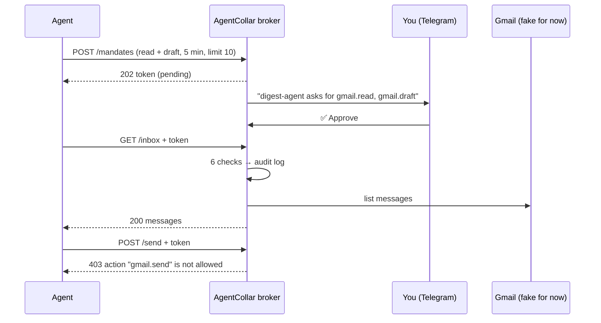

<p align="center">
  
</p>

<h1 align="center">AgentCollar</h1>

<p align="center">
  <a href="https://github.com/ank8dev/agentcollar/actions/workflows/test-broker.yml"></a>
</p>

<p align="center">
  <strong>Let agents work. Keep the keys.</strong><br />
  A small broker between your AI agents and your accounts.<br />
  Agents get a short-lived pass for one task — never your password.
</p>

<p align="center">
  <a href="https://ank8dev.github.io/agentcollar/">Website</a> ·
  <a href="#quick-start">Quick start</a> ·
  <a href="#the-agcl-command">CLI</a> ·
  <a href="#use-it-from-claude-code-mcp">MCP</a> ·
  <a href="#how-it-works">How it works</a> ·
  <a href="#roadmap">Roadmap</a>
</p>

> **Status: early, building in public.** The broker works end to end with a **fake Gmail inbox**,
> a terminal CLI (`agcl`) and an MCP server for Claude Code. Real Gmail is next. Do not connect real accounts yet.
>
> **Hobby project. Use at your own risk. Do not connect accounts you can't afford to lose.**

---

## Why

Today you connect an agent to Gmail once, and it can read, send and delete — until you remember to turn it off.
That is not giving work to an employee. That is giving a stranger your house keys.

AgentCollar puts a gate in between:

- **The agent never sees your password or tokens.** It only holds a random mandate token.
- **Access is per task, not per connection:** "read + draft, for 5 minutes, max 10 actions".
- **A human approves every mandate** — in Telegram or in the terminal.
- **Every request is checked**, and every decision is written to an audit log.
- **One tap revokes** a mandate instantly.

## How it works



### The 6 checks

Every request runs these checks **in order**. The first one that fails stops the request.

| # | Check | If it fails |
|---|---|---|
| 1 | The token is known (we issued it) | `401` unknown token |
| 2 | A human approved the mandate | `403` waiting for approval / denied |
| 3 | The mandate has not expired | `403` expired |
| 4 | The mandate was not revoked | `403` revoked |
| 5 | This action is in the mandate | `403` action not allowed |
| 6 | The action limit is not reached | `429` limit reached |

The clock starts **on approval**, not on request. Only allowed actions count towards the limit.

## Quick start

Requires **Node.js 22+**.

```bash
npx agentcollar              # run without installing
npm install -g agentcollar   # or install it: then the short name `agcl` works too
agcl                         # intro → setup wizard (first time) → broker
```

Working on the code? Run it from source instead:

```bash
git clone https://github.com/ank8dev/agentcollar
cd agentcollar/broker
npm install                # also builds dist/
npm link                   # puts `agcl` and `agentcollar` on your PATH
```

**The setup wizard** (`agcl setup`) connects **your own** Telegram bot without editing any file:
paste the token from [@BotFather](https://t.me/BotFather) (hidden while you type, checked with
Telegram), open the link it shows and press **Start** — it takes your user id from that message,
using a one-time code so a stranger pressing Start at the same moment cannot become the approver.
Settings go to `~/.agentcollar/.env` (readable only by you).

**Try the whole flow with a pretend agent** (from `broker/`, two terminals):

```bash
agcl server        # terminal 1: the broker (approve in Telegram, or here with y)
npm run agent      # terminal 2: asks for a mandate, waits for you, reads, drafts, tries to send
```

**Or just the core, in one command** (no network, no Telegram): `npm run demo`.

## The `agcl` command

`agcl` is the short name of `agentcollar`: **`agcl watch` == `agentcollar watch`**.

| Command | What it does |
|---|---|
| `agcl` | intro → setup (if not set up yet) → broker |
| `agcl setup` | connect your Telegram bot (moves old `broker/.env` to `~/.agentcollar/` if found) |
| `agcl server` | start the broker on `127.0.0.1:8787` |
| `agcl watch` | live screen: every agent request as it happens, `✓ ✓ ✓ ✓ ✗ ·` = which of the 6 checks failed |
| `agcl mandates` | mandates of the running broker: state, time left, actions left |
| `agcl logs [--agent <name>] [--denied] [--today]` | the audit log, filtered |
| `agcl revoke <id>` | kill switch: revoke a mandate instantly (works without internet) |
| `agcl mcp` | MCP server over stdio for Claude Code and other agents |

`--no-intro` skips the intro; it is also skipped automatically in pipes, CI and with `NO_COLOR`.
`watch`, `logs` and `mandates` only **read** files in `~/.agentcollar/`: no extra HTTP endpoints.

## Use it from Claude Code (MCP)

```bash
claude mcp add agentcollar -- npx -y agentcollar mcp
claude mcp add agentcollar -- agcl mcp                   # from source, after npm link
```

Then ask Claude: *"through agentcollar, read my inbox and draft a reply to the first email"*.
Claude calls `request_mandate`, you approve in Telegram, then it uses `gmail_read_inbox` and
`gmail_create_draft`. `gmail_send` is refused unless you approved sending. The mandate token stays
inside the MCP server: the model only ever sees the mandate id, so a prompt injection in an email
has no token to steal.

## API

The broker listens on `127.0.0.1:8787` only. Agents send the mandate token as `Authorization: Bearer <token>`.

| Method | Path | Action checked | Notes |
|---|---|---|---|
| `POST` | `/mandates` | — | Ask for a mandate. Body: `agent`, `task`, `allowedActions` (e.g. `["gmail.read"]`), `expiresInSeconds` (≤ 86400), `limit` (≤ 1000). Returns `202` + token |
| `GET` | `/mandate` | — | The state of your own mandate (`pending`, `approved`, …) |
| `POST` | `/mandates/:id/revoke` | — | Kill switch. Revoking only removes access |
| `GET` | `/inbox` | `gmail.read` | Fake inbox |
| `POST` | `/drafts` | `gmail.draft` | Body: `to`, `subject`, `body` |
| `POST` | `/send` | `gmail.send` | Same body. Denied unless the mandate allows sending |

## Security notes

What the broker already does, and why:

- **Tokens are 256-bit random** and never written to the audit log.
- **The audit log is append-only**, one line per event. Text from agents is escaped, so an agent cannot forge extra log lines.
- **The approval message cannot be spoofed.** Actions must look exactly like `app.verb`. The facts the broker enforces are shown first; the agent's own words come last, on one sanitized line. A request for `*.send` shows a clear warning.
- **Only your Telegram account can approve.** Presses from anyone else are ignored.
- **No requests from browsers.** A web page can also reach `localhost`, so the broker checks the `Host` header (against DNS rebinding), refuses requests with an `Origin`, and accepts only `application/json`.
- **Small, bounded input:** bodies up to 10 KB, at most 20 actions, at most 1 day per mandate.
- **Approval is never possible over HTTP or through files.** Only in Telegram (only your user id) or in the broker's own terminal, so a local agent cannot approve itself. The CLI reads files the broker writes; the broker never reads commands from files.
- **Fail closed:** a request nobody answers in 10 minutes is denied; the Telegram message and the terminal say so.
- **Your data lives in `~/.agentcollar/`** (folder `700`, files `600`): `.env`, `audit.log`, `mandates.json`. The snapshot lists mandates without their tokens (an allowlist of fields).
- **Terminal output is sanitized:** agent names and reasons are stripped of control characters before `agcl watch` / `logs` print them.
- **No runtime dependencies.** Only Node's built-ins: `http`, `crypto`, `fetch`, `fs`. The MCP server is our own small JSON-RPC implementation.
- **Published with npm provenance** from GitHub Actions (trusted publishing, no npm token stored anywhere): anyone can check which commit a release was built from with `npm audit signatures`.

Known limits today: mandates live in memory (they disappear when the broker stops), Gmail is fake, and there is no encryption at rest yet because there are no real secrets to store.

## Roadmap

- [x] Mandates, the 6 checks, revoke, audit log
- [x] Local HTTP server and a pretend agent
- [x] Human approval in the terminal and in Telegram
- [x] Real Gmail: `agcl gmail connect` (OAuth with PKCE, scopes `gmail.readonly` + `gmail.drafts.create`, refresh token in the macOS Keychain). The connection cannot send at all: sending is blocked by the broker **and** by Google
- [ ] Refresh token encrypted at rest, key in the macOS Keychain
- [x] An MCP interface, so existing agents can use the broker
- [x] A terminal CLI: `agcl` (setup wizard, live watch, mandates, logs, revoke)
- [x] One-command install from npm (`npx agentcollar`), published with provenance ([v0.1.0](https://www.npmjs.com/package/agentcollar))
- [ ] Mandates survive a restart
- [ ] Morning report: what every agent did tonight

## Repository

| Folder | What |
|---|---|
| [`broker/`](broker/) | The broker and the `agcl` CLI: TypeScript, runs on your own machine; published to npm as `agentcollar` |
| [`docs/`](docs/) | Learning guide (`docs/learn-by-running.md`) and parked ideas (`docs/ideas/`) |
| [`landing/`](landing/) | The website (Vite + GSAP), deployed to GitHub Pages on every push to `main` that changes `landing/` |
| [`brand/`](brand/) | Logos and hand-drawn illustrations |

Run the website locally: `cd landing && npm install && npm run dev`.

Want to help? Read [CONTRIBUTING.md](CONTRIBUTING.md). Found a security problem? Report it privately, see [SECURITY.md](SECURITY.md). Changes per version: [CHANGELOG.md](CHANGELOG.md).

## License

Code: [MIT](LICENSE). Brand assets in `brand/` (logos, illustrations): © ank8dev, all rights reserved.
Security policy: [SECURITY.md](SECURITY.md) · Contributing: [CONTRIBUTING.md](CONTRIBUTING.md)

## Author

Built by [@ank8dev](https://github.com/ank8dev) — learning to be an engineer by building this in public.
